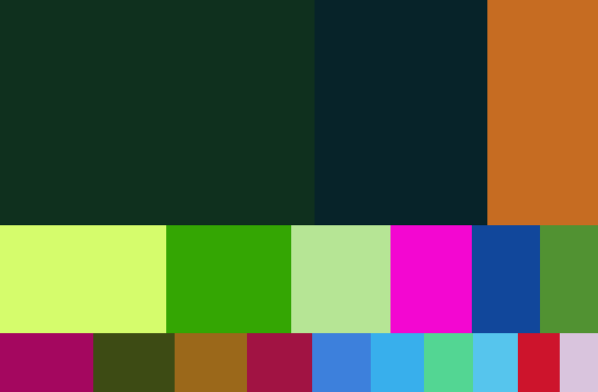

# Treemap

python



```python
#! /usr/bin/env/python

from treemap import computeSTM
from random import randint
from math import ceil

import Image, ImageDraw

# initial rectangle dimensions
r = (16,9)

# list of areas to place on the rectangle
areas = map(lambda x: (1/(float(pow(x,1.6))+1))*40, range(1,24))

# scale
s = 100

def scale(lst):
    return map(lambda x: int(ceil(x*s)), lst)

def rndcolour():
    return (randint(0,255), randint(0,255), randint(0,255))

im = Image.new("RGBA", scale(r))

draw = ImageDraw.Draw(im)

for box in computeSTM(r, areas):
    print "drawing ", scale(box)
    draw.rectangle(scale(box), fill=rndcolour())

del draw 

# write to stdout
im.save("test.png", "PNG")
```
